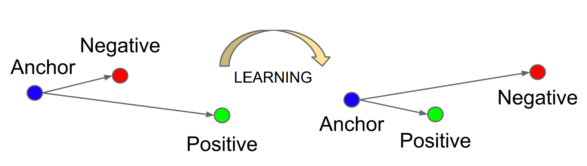
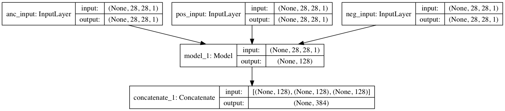
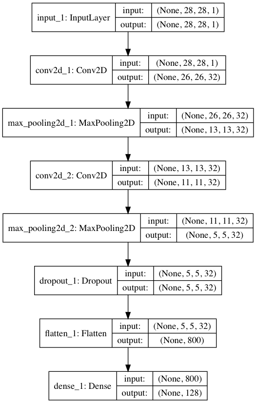
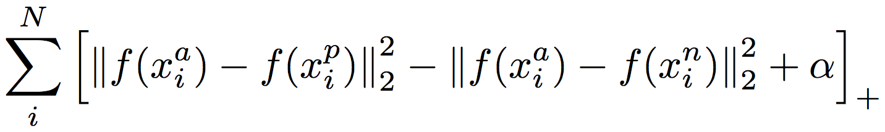
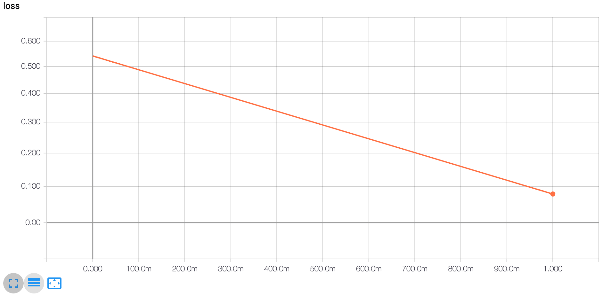
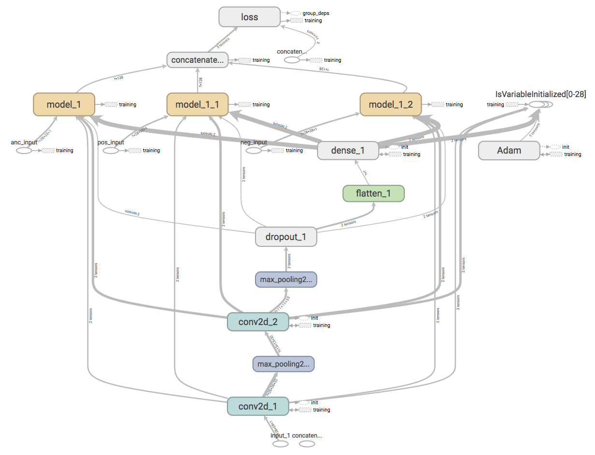
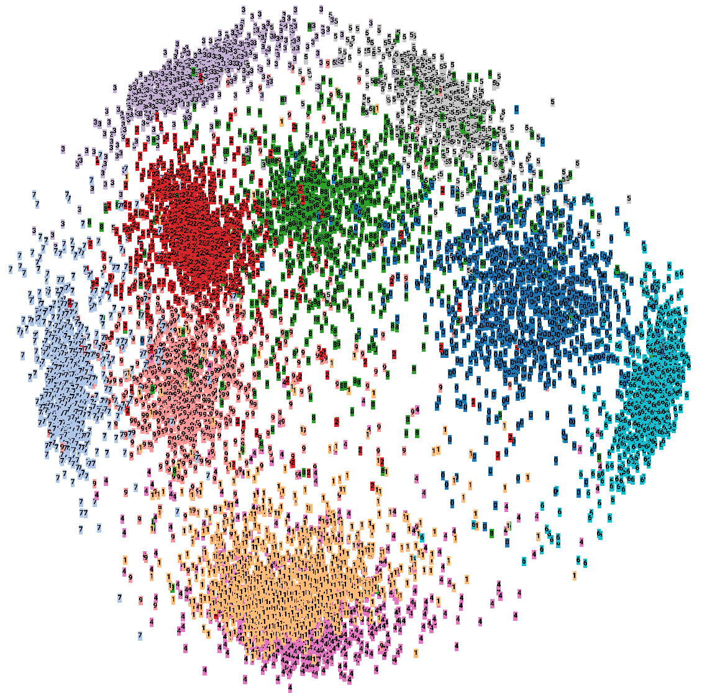

# Triplet Loss 算法

[Triplet Loss](https://arxiv.org/pdf/1503.03832.pdf)是深度学习中的一种损失函数，用于训练**差异性较小**的样本，如人脸等， Feed数据包括锚（Anchor）示例、正（Positive）示例、负（Negative）示例，通过优化锚示例与正示例的距离**小于**锚示例与负示例的距离，实现样本的相似性计算。




数据集：[MNIST](http://yann.lecun.com/exdb/mnist/)

工程框架：[DL-Project-Template](https://github.com/SpikeKing/DL-Project-Template)

目标：通过Triplet Loss训练模型，实现手写图像的相似性计算。

---

## 模型

Triplet Loss的核心是锚示例、正示例、负示例共享模型，通过模型，将锚示例与正示例聚类，远离负示例。

**Triplet Loss Model**的结构如下：



- 输入：三个输入，即锚示例、正示例、负示例，不同示例的**结构**相同；
- 模型：一个共享模型，支持替换为**任意**网络结构；
- 输出：一个输出，即三个模型输出的拼接。

**Shared Model**选择常用的卷积模型，输出为全连接的128维数据：



Triplet Loss**损失函数**的计算公式如下：



---

## 训练

模型参数：

- batch_size：32
- epochs：2

超参数：

- 边界Margin的值设置为``1``。

算法收敛较好，Loss线性下降：



TF Graph：



---

## 验证

执行效率（TPS）: 每秒48163.756773次 (0.0207625 ms/t)

MNIST验证集的效果：

``` bash
[INFO] trainer - clz 0
[INFO] trainer - distance - min: -15.4567, max: 1.98611, avg: -6.50481
[INFO] acc: 0.996632996633

[INFO] trainer - clz 1
[INFO] trainer - distance - min: -13.09, max: 3.43779, avg: -6.66867
[INFO] acc: 0.99214365881

[INFO] trainer - clz 2
[INFO] trainer - distance - min: -14.2524, max: 2.49437, avg: -5.60508
[INFO] acc: 0.991021324355

[INFO] trainer - clz 3
[INFO] trainer - distance - min: -16.6555, max: 1.21776, avg: -6.32161
[INFO] acc: 0.995510662177

[INFO] trainer - clz 4
[INFO] trainer - distance - min: -14.193, max: 1.65427, avg: -5.90896
[INFO] acc: 0.991021324355

[INFO] trainer - clz 5
[INFO] trainer - distance - min: -14.1007, max: 2.01843, avg: -6.36086
[INFO] acc: 0.994388327722

[INFO] trainer - clz 6
[INFO] trainer - distance - min: -16.8953, max: 2.84421, avg: -8.43978
[INFO] acc: 0.995510662177

[INFO] trainer - clz 7
[INFO] trainer - distance - min: -16.6177, max: 3.49675, avg: -5.99822
[INFO] acc: 0.989898989899

[INFO] trainer - clz 8
[INFO] trainer - distance - min: -14.937, max: 3.38141, avg: -5.4424
[INFO] acc: 0.979797979798

[INFO] trainer - clz 9
[INFO] trainer - distance - min: -16.9519, max: 2.39112, avg: -5.93581
[INFO] acc: 0.985409652076
```

测试的MNIST分布：


输出的Triplet Loss MNIST分布：



本例仅仅使用2个Epoch，也没有特殊设置超参，实际效果仍有提升空间。

---

By C. L. Wang @ [美图](http://www.meipai.com/)云事业部

That's all! Enjoy it!